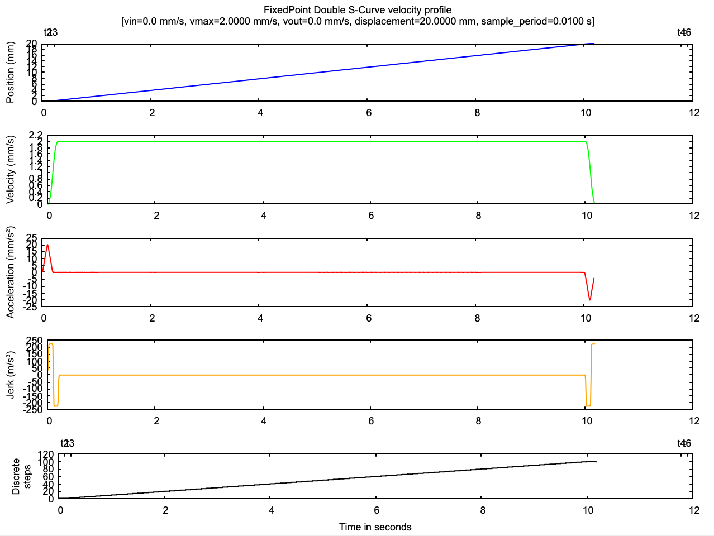

[](https://crates.io/crates/prinThor)

[](https://coveralls.io/github/cbruiz/printhor?branch=main)[](https://opensource.org/licenses/MIT)


<h3>Printhor: The highly reliable but not necessarily functional 3D printer and robotics firmware</h3>

<h5><p align="center"><i>If you are using this product or like the project, please <a href="https://github.com/cbruiz/printhor/stargazers">★</a> this repository to show your support! 🤩</i></p></h5>

# Overview

Printhor is a generic and hardware-agnostic (firmware) framework for FDM printers, CNC, Engravers and robots implemented in Rust.

Basically, it's a GCode interpreter capable to process a stream of GCodes (position and control orders), schedule them, compute a motion profile on the fly and finally perform the hardware level instructions (step pulses, PWM signals, ... or even dataframes broadcast for a dedicated breakboard) in real time.

There are many productive firmwares in the community like gbrl, marlin, reprap, etc. Each single one have a concrete approach and guidelines.
This one aims to provide a research environment for not strictly productive purpose, but a reliable platform with the following goals:
* Robustness.
* Numerical stability.
* Efficient resources utilization and close-to-preemptive multitasking.
  * Leverage async multitasking.
  * Maintain busy waits to a minimum.
  * Ensure leverage of DMA transfers as much as possible.
  * Ensure of leverage of FPU when present.
* Simplicity.
* Clarity and readability.

Which means the principal short-term goal is not to develop a productive firmware for final user rather than providing an environment in which anyone can test and experiment any concrete approach to feed the community with good quality, state-of-the-art or innovative feature increments.

## Features
* "Clean" hardware abstraction.
* Vector geometry / linear algebra calculus for kinematics
  * Smooth acceleration and jerk limited motion plan leveraging "Trajectory with Double S Velocity Profile" [1]. Briefly explained at [Plan implementation](src/bin/printhor/control/motion/profile.rs) and visualy explained in [Printhor motion plan. A simplified overview of the velocity integration](https://www.geogebra.org/m/hwpnmhcu) (GeoGebra).
    
    "[1] Biagiotti, L., Melchiorri, C.: Trajectory Planning for Automatic Machines and Robots. Springer, Heidelberg (2008). [DOI:10.1007/978-3-540-85629-0](https://doi.org/10.1007/978-3-540-85629-0)"
  * High precision and deterministic kinematics and computations with configurable resolution. Briefly explained at [Stepper Task](src/bin/printhor/control/task_stepper.rs).
  * Simple and efficient cornering algorithm based on pure linear algebra. Foundation implicitly explained at [Printhor naïve cornering algorithm](https://www.geogebra.org/m/ft8svrwd) (GeoGebra).
* Precise thermal control plan with PID. Briefly exlained at [Temperature Task](src/bin/printhor/control/task_temperature.rs).
* Simple, secure and efficient resource and peripherals sharing.
* Clean and simple async tasks coordination/intercommunication with event based primitives.
* High behavior customization.
* Low level action distribution leveraging dedicated break-boards. 
* Wide GCode standard coverage.
* Native simulation for development and benchmarking.
  * Many others coming.

## Overall status

<table>
    <thead>
        <tr><th>Feature</th><th>Status</th></tr>
    </thead>
    <tbody>
        <tr><td>Simulation</td><td>Functional</td></tr>
        <tr><td>I/O</td><td>Functional</td></tr>
        <tr><td>State and logic</td><td>Testing</td></tr>
        <tr><td>Motion Planner</td><td>Functional</td></tr>
        <tr><td>Kinematics</td><td>Testing</td></tr>
        <tr><td>Thermal Control</td><td>Incubation</td></tr>
        <tr><td>Display</td><td>TODO</td></tr>
        <tr><td>Laser/CNC</td><td>Draft</td></tr>
    </tbody>
</table>

Assuming the following maturity convention:
 TODO -> Draft -> Incubation -> Testing -> Functional -> Done

# Help wanted
If you are interested in this project and want to collaborate, you are welcome.
A Discord server has been created for informal discussions. Otherwise, GitHub Issues and Pull Requests are preferred.  
[](https://discord.gg/VSag6T4KS6)

# Checkout

```shell
git clone https://github.com/cbruiz/printhor
cd printhor
git submodule update --init --recursive
```

# Build

The minimal toolset required to build and run is:
* Rust, in order to compile 
* cargo binutils, to produce the image binary that you can flash via SD card as usual.
* __[Optionally]__ probe-run, if you are willing to use a SWD/Jlink debugger (https://github.com/knurling-rs/probe-run)
* __[Optionally]__ cargo-bloat and cargo-size utils are great to analyze the code size.
* __[Optionally]__ A Rust IDE, like [Jetbrains IDE suite](https://www.jetbrains.com/) (IntelliJ, CLion or RustRover) (recommended), Visual Studio Code (also fine), or others

## Prerequisites: Rust and toolchain

This crate requires **Rust >= 1.79**.

For official guide, please see https://www.rust-lang.org/tools/install

However, if your os is unix based:
```shell
curl --proto '=https' --tlsv1.2 -sSf https://sh.rustup.rs | sh
rustup update
```

For microcontrollers (currently few stm32 only), the specific target toolchain and cargo binutils is also needed:

```shell
rustup target add thumbv7em-none-eabi
rustup target add thumbv7em-none-eabihf
rustup target add thumbv6m-none-eabi
rustup component add llvm-tools
cargo install cargo-binutils
```

Optionally, for debugging on baremetal microcontrollers (currently few stm32 only):

```shell
cargo install probe-run
```

## Native simulator backend

The framework with a set of mocked peripherals (most of them without any logic).
Provides a commandline GCode prompt on standard input

__Note__: A SDCard image in ./data/ is required to be open if sd-card feature is enabled in native :)

```shell
RUST_LOG=info cargo run --bin printhor
```

### Integration tests

Native backend has a special feature called integration-test which is used to perform "some kind of" integration tests. Still
pending to be matured.

```shell
RUST_LOG=info cargo run --features integration-test --bin printhor
```

Testing with GCode sender though socat

```shell
RUST_LOG=info cargo build --bin printhor
socat pty,link=printhor,rawer EXEC:target/debug/printhor,pty,rawer
```

## Supported boards and specific instructions

| Board                                                                                             | Status            |
|---------------------------------------------------------------------------------------------------|-------------------|
| [SKR Mini E3 V2.0](hwi-boards/printhor-hwi_skr_mini_e3/README.md)                                 | Initial           |
| [SKR Mini E3 V3.0](hwi-boards/printhor-hwi_skr_mini_e3/README.md)                                 | Almost Functional |
| [MKS Robin Nano v3.1](hwi-boards/printhor-hwi_mks_robin_nano/README.md)                           | Almost Functional |
| [Nucleo-f410rb + Arduino CNC Hat v3](hwi-boards/printhor-hwi_nucleo_64_arduino_cnc_hat/README.md) | Almost Functional |
| [Nucleo-l476rg + Arduino CNC Hat v3](hwi-boards/printhor-hwi_nucleo_64_arduino_cnc_hat/README.md) | Almost Functional |
| [Raspberry PI 2040](hwi-boards/printhor-hwi_rp_2040/README.md)                                    | Draft             |


## Extra utilery

A simple stand-alone std binary to experiment with motion plan and see what it does (kind of playground):

```shell
cd s-plot
cargo run
```

### Example output with the current plotting style approach:
As Image:


As Vector:

<object data="./design/motion_plan.pdf" type="application/pdf" width="700px" height="700px">
  <embed src="./design/motion_plan.pdf">
    <p style="text-align: center;">This browser does not support PDFs. Please <a href="./design/motion_plan.pdf">Download the PDF</a> to view it</p>
</object>

There are (currently) two plots:
* Position:
  * A continuous blue curve for the analytic __ideal__ position estimation.
  * A stepped gray curve for the __real__ (discrete) position. 
* Velocity:
  * A continuos green curve for the online derivation of __ideal__ position datapoints.
  * A slopped gray polyline for the online derivation of __real__ (discrete) position datapoints in the sampling interval.

### Example output with the deprecated plotting style:


This plot were self-explanatory, but deprecated in flavor of the previous one.
We are keeping it because it is clear and useful for a high level understanding.

# TODO
* Code productivization. Mostly based on https://dl.acm.org/doi/pdf/10.1145/3519941.3535075 and https://jamesmunns.com/blog/fmt-unreasonably-expensive/:
  * Code size reduction.
  * Remove unwrap/panic calls.
  * Remove unsafe code (a little bit, but there it is)
  * Remove trivial/redundant computation __but not compromising readability__.
* Unit test 
* CoreXY support
* Display
* I/O control
  * xonxoff
* Adaptative planing cost measurement to take a decision on chaining or not and how much (AKA Cornering).
* exfat support could be great.

# Customization

For a single board, the high-level features (hotend, hotbed, fan, SDCard, ... ) can be activated/deactivated by cargo feature selection or directly editing the main cargo.toml
In order to change pins, writing/adapting some code is required, as of now. There is not expected to be, at least in the short term any kind of configuration file.

Because of that limitation (Rust makes that hard to tackle because of the strict typing), a clean code organization it's crucial and pretty straightforward to assume slight customizations by editing code.  

# Architecture

printhor is composed by the following architectural blocks
* embassy-rs, as the harware and async foundation https://github.com/embassy-rs/embassy
* async-gcode, as the core of the GCode interpretation  https://github.com/ithinuel/async-gcode
* printhor-hwa-common (within the project), as the hardware abstraction layer contract and common machinery
* A set of crates (withn the project) for each harware/board. Currently:
  * printhor-hwi_native : The native simulator.
  * printhor-hwi_skr_mini_e3 : Two boards: V2 (See [Datasheets/SKR_MINI_E3-V2.0](datasheets/SKR_MINI_E3-V2.0)) and V3 (See [Datasheets/SKR_MINI_E3-V3.0](datasheets/SKR_MINI_E3-V3.0))
  * printhor-hwi_mks_robin_nano_v3_1 : (See [Datasheets/MKS-ROBIN-NANO-V3.1](datasheets/MKS-ROBIN-NANO-V3.1))
  * printhor-hwi_nucleo_64_arduino_cnc_hat : A Nucleo-64 development board (currently L476RG or F410RB) with Arduino CNC Shield v3.x (See [Datasheets/NUCLEO-L476RG_CNC_SHIELD_V3](datasheets/NUCLEO-L476RG))

Intentionally, traits are in general avoided in HWI layer when not strictly required in favour of defining a more decoupled and easy to evolve interface based on:
* type aliases
* module exports

[Advanced documentation](doc/README.md)

# Similar, related software and shout-outs

* https://embassy.dev/ Rust Embassy; The next-generation framework for embedded applications. The most important and core framework conforming the pillars of this project.
* https://github.com/ithinuel/async-gcode This powerful GCode implementation is a fundamental piece of this project.
* https://github.com/nviennot/turbo-resin Exactly the same a printhor but focused in resin printers. The Project which inspired and motivated this one.
* https://github.com/marcbone/s_curve A really appreciated know-how. The current selected motion profile is based on this work, but intense reinterpretation were performed to make this project work.The book referenced by the author of s-curve is a key reading considered to conduct the goals of the motion plan. Nevertheless, our implementation is still un-mature/unproven to ask for a merge. 

# GCode compliancy [Draft]

Gcode implementation status, as from https://reprap.org/wiki/G-code

* WIP: Work In Progress
* ILT: In the Long Term
* TODO: To Do

<table><thead>
    <tr><th>M-Code</th><th>Mode</th><th>Description</th><th>Status</th></tr>
</thead><tbody>
    <tr>
        <td rowspan="1">M</td>
        <td>*</td>
        <td>List all supported m-codes</td>
        <td>DONE</td>
    </tr>
    <tr>
        <td rowspan="1">M0</td>
        <td>*</td>
        <td>Stop or Unconditional stop</td>
        <td>WIP</td>
    </tr>
    <tr>
        <td rowspan="1">M1</td>
        <td>*</td>
        <td>Sleep or Conditional stop</td>
        <td>WIP</td>
    </tr>
    <tr>
        <td rowspan="1">M2</td>
        <td>*</td>
        <td>Program End</td>
        <td>WIP</td>
    </tr>
    <tr>
        <td rowspan="2">M3</td>
        <td>CNC</td>
        <td>Spindle On, Clockwise</td>
        <td>WIP</td>
    </tr>
    <tr>
        <td>LASER</td>
        <td>Laser On</td>
        <td>WIP</td>
    </tr>
    <tr>
        <td rowspan="2">M4</td>
        <td>CNC</td>
        <td>Spindle On, Counter-Clockwise</td>
        <td>WIP</td>
    </tr>
    <tr>
        <td>LASER</td>
        <td>Laser On</td>
        <td>WIP</td>
    </tr>
    <tr>
        <td rowspan="2">M5</td>
        <td>CNC</td>
        <td>Spindle Off</td>
        <td>WIP</td>
    </tr>
    <tr>
        <td>LASER</td>
        <td>Laser Off</td>
        <td>WIP</td>
    </tr>
    <tr>
        <td rowspan="1">M6</td>
        <td>*</td>
        <td>Tool change</td>
        <td>ILT</td>
    </tr>
    <tr>
        <td rowspan="1">M7</td>
        <td>CNC</td>
        <td>Mist Coolant On</td>
        <td>ILT</td>
    </tr>
    <tr>
        <td rowspan="1">M8</td>
        <td>CNC</td>
        <td>Flood Coolant On</td>
        <td>ILT</td>
    </tr>
    <tr>
        <td rowspan="1">M9</td>
        <td>CNC</td>
        <td>Coolant Off</td>
        <td>ILT</td>
    </tr>
    <tr>
        <td rowspan="1">M10</td>
        <td>CNC</td>
        <td>Vacuum On</td>
        <td>ILT</td>
    </tr>
    <tr>
        <td rowspan="1">M11</td>
        <td>CNC</td>
        <td>Vacuum Off</td>
        <td>ILT</td>
    </tr>
    <tr>
        <td rowspan="1">M13</td>
        <td>CNC</td>
        <td>Spindle on (clockwise rotation) and coolant on (flood)</td>
        <td>ILT</td>
    </tr>
    <tr>
        <td rowspan="1">M16</td>
        <td>CNC</td>
        <td>Expected Printer Check</td>
        <td>TODO</td>
    </tr>
    <tr>
        <td rowspan="1">M17</td>
        <td>*</td>
        <td>Enable/Power all stepper motors</td>
        <td>WIP</td>
    </tr>
    <tr>
        <td rowspan="1">M18</td>
        <td>*</td>
        <td>Disable all stepper motors</td>
        <td>WIP</td>
    </tr>
    <tr>
        <td rowspan="1">M20</td>
        <td>*</td>
        <td>List SD card</td>
        <td>DONE*</td>
    </tr>
    <tr>
        <td rowspan="1">M21</td>
        <td>*</td>
        <td>Initialize SD card</td>
        <td>TODO</td>
    </tr>
    <tr>
        <td rowspan="1">M22</td>
        <td>*</td>
        <td>Release SD card</td>
        <td>TODO</td>
    </tr>
    <tr>
        <td rowspan="1">M23</td>
        <td>*</td>
        <td>Select SD file</td>
        <td>DONE</td>
    </tr>
    <tr>
        <td rowspan="1">M24</td>
        <td>*</td>
        <td>Start/resume SD print</td>
        <td>DONE</td>
    </tr>
    <tr>
        <td rowspan="1">M25</td>
        <td>*</td>
        <td>Pause SD print</td>
        <td>DONE</td>
    </tr>
    <tr>
        <td rowspan="1">M26</td>
        <td>*</td>
        <td>Set SD position</td>
        <td>ILT</td>
    </tr>
    <tr>
        <td rowspan="1">M27</td>
        <td>*</td>
        <td>Report SD print status</td>
        <td>TODO</td>
    </tr>
    <tr>
        <td rowspan="1">M30</td>
        <td>*</td>
        <td>Program Stop</td>
        <td>TODO</td>
    </tr>
    <tr>
        <td rowspan="1">M31</td>
        <td>*</td>
        <td>Output time since last M109 or SD card start to serial</td>
        <td>TODO</td>
    </tr>
    <tr>
        <td rowspan="1">M32</td>
        <td>*</td>
        <td>Select file and start SD print</td>
        <td>TODO</td>
    </tr>
    <tr>
        <td rowspan="1">M33</td>
        <td>*</td>
        <td>Get the long name for an SD card file or folder</td>
        <td>ILT</td>
    </tr>
    <tr>
        <td rowspan="1">M37</td>
        <td>*</td>
        <td>Simulation mode (Dry run mode)</td>
        <td>DONE</td>
    </tr>
    <tr>
        <td rowspan="1">M73</td>
        <td>*</td>
        <td>Set/Get build percentage</td>
        <td>TODO</td>
    </tr>
    <tr>
        <td rowspan="1">M79</td>
        <td>*</td>
        <td>Soft reset</td>
        <td>DONE</td>
    </tr>
    <tr>
        <td rowspan="1">M80</td>
        <td>*</td>
        <td>ATX Power On</td>
        <td>WIP</td>
    </tr>
    <tr>
        <td rowspan="1">M81</td>
        <td>*</td>
        <td>ATX Power Off</td>
        <td>WIP</td>
    </tr>
    <tr>
        <td rowspan="1">M82</td>
        <td>*</td>
        <td>Set extruder to absolute mode</td>
        <td>WIP</td>
    </tr>
    <tr>
        <td rowspan="1">M83</td>
        <td>*</td>
        <td>Set extruder to relative mode</td>
        <td>WIP</td>
    </tr>
    <tr>
        <td rowspan="1">M92</td>
        <td>*</td>
        <td>Set axis_steps_per_unit</td>
        <td>WIP</td>
    </tr>
    <tr>
        <td rowspan="1">M104</td>
        <td>FFF</td>
        <td>Set Hotend Temperature</td>
        <td>DONE</td>
    </tr>
    <tr>
        <td rowspan="1">M105</td>
        <td>FFF</td>
        <td>Get Hotend and/or Hotbed Temperature</td>
        <td>DONE</td>
    </tr>
    <tr>
        <td rowspan="1">M106</td>
        <td>*</td>
        <td>Fan On</td>
        <td>WIP</td>
    </tr>
    <tr>
        <td rowspan="1">M107</td>
        <td>*</td>
        <td>Fan Off</td>
        <td>WIP</td>
    </tr>
    <tr>
        <td rowspan="1">M109</td>
        <td>FFF</td>
        <td>Set Extruder Temperature and Wait</td>
        <td>DONE</td>
    </tr>
    <tr>
        <td rowspan="1">M110</td>
        <td>*</td>
        <td>Set Current Line Number</td>
        <td>WIP</td>
    </tr>
    <tr>
        <td rowspan="1">M111</td>
        <td>*</td>
        <td>Set Debug Level</td>
        <td>WIP</td>
    </tr>
    <tr>
        <td rowspan="1">M112</td>
        <td>*</td>
        <td>Full (Emergency) Stop</td>
        <td>WIP</td>
    </tr>
    <tr>
        <td rowspan="1">M114</td>
        <td>*</td>
        <td>Get Current Position</td>
        <td>DONE</td>
    </tr>
    <tr>
        <td rowspan="1">M115</td>
        <td>*</td>
        <td>Get Firmware Version and Capabilities</td>
        <td>DONE</td>
    </tr>
    <tr>
        <td rowspan="1">M116</td>
        <td>*</td>
        <td>Wait</td>
        <td>WIP</td>
    </tr>
    <tr>
        <td rowspan="1">M117</td>
        <td>*</td>
        <td>Display message</td>
        <td>DONE</td>
    </tr>
    <tr>
        <td rowspan="1">M118</td>
        <td>*</td>
        <td>Echo message on host</td>
        <td>DONE</td>
    </tr>
    <tr>
        <td rowspan="1">M119</td>
        <td>*</td>
        <td>Get Endstop Status</td>
        <td>DONE</td>
    </tr>
    <tr>
        <td rowspan="1">M120</td>
        <td>*</td>
        <td>Enable endstop detection</td>
        <td>ILT</td>
    </tr>
    <tr>
        <td rowspan="1">M121</td>
        <td>*</td>
        <td>Disable endstop detection</td>
        <td>ILT</td>
    </tr>
    <tr>
        <td rowspan="1">M140</td>
        <td>*</td>
        <td>Set hotbed Temperature (Fast)</td>
        <td>DONE</td>
    </tr>
    <tr>
        <td rowspan="1">M190</td>
        <td>*</td>
        <td>Wait for hotbed temperature</td>
        <td>DONE</td>
    </tr>
    <tr>
        <td rowspan="1">M200</td>
        <td>*</td>
        <td>Set filament diameter</td>
        <td>WIP</td>
    </tr>
    <tr>
        <td rowspan="1">M201</td>
        <td>*</td>
        <td>Set max acceleration</td>
        <td>WIP</td>
    </tr>
    <tr>
        <td rowspan="1">M202</td>
        <td>*</td>
        <td>Set max travel acceleration</td>
        <td>WIP</td>
    </tr>
    <tr>
        <td rowspan="1">M203</td>
        <td>*</td>
        <td>Set maximum feedrate</td>
        <td>WIP</td>
    </tr>
    <tr>
        <td rowspan="1">M204</td>
        <td>*</td>
        <td>Set default acceleration</td>
        <td>WIP</td>
    </tr>
    <tr>
        <td rowspan="1">M205</td>
        <td>*</td>
        <td>Advanced settings</td>
        <td>WIP</td>
    </tr>
    <tr>
        <td rowspan="1">M206</td>
        <td>*</td>
        <td>Offset axes</td>
        <td>WIP</td>
    </tr>
    <tr>
        <td rowspan="1">M207</td>
        <td>*</td>
        <td>Set retract length</td>
        <td>WIP</td>
    </tr>
    <tr>
        <td rowspan="1">M208</td>
        <td>*</td>
        <td>Set unretract length</td>
        <td>WIP</td>
    </tr>
    <tr>
        <td rowspan="1">M209</td>
        <td>FFF</td>
        <td>Enable automatic retract</td>
        <td>WIP</td>
    </tr>
    <tr>
        <td rowspan="1">M210</td>
        <td>*</td>
        <td>Set homing feedrates</td>
        <td>WIP</td>
    </tr>
    <tr>
        <td rowspan="1">M211</td>
        <td>*</td>
        <td>Disable/Enable software endstops</td>
        <td>WIP</td>
    </tr>
    <tr>
        <td rowspan="1">M212</td>
        <td>*</td>
        <td>Set Bed Level Sensor Offset</td>
        <td>WIP</td>
    </tr>
    <tr>
        <td rowspan="1">M218</td>
        <td>*</td>
        <td>Set Hotend Offset</td>
        <td>WIP</td>
    </tr>
    <tr>
        <td rowspan="1">M220</td>
        <td>*</td>
        <td>Set speed factor override percentage</td>
        <td>WIP</td>
    </tr>
    <tr>
        <td rowspan="1">M221</td>
        <td>*</td>
        <td>Set extrude factor override percentage</td>
        <td>WIP</td>
    </tr>
    <tr>
        <td rowspan="1">M290</td>
        <td>*</td>
        <td>Babystepping</td>
        <td>WIP</td>
    </tr>
    <tr>
        <td rowspan="1">M302</td>
        <td>*</td>
        <td>Allow cold extrudes</td>
        <td>ILT</td>
    </tr>
    <tr>
        <td rowspan="1">M305</td>
        <td>*</td>
        <td>Set thermistor and ADC parameters</td>
        <td>ILT</td>
    </tr>
    <tr>
        <td rowspan="1">M350</td>
        <td>*</td>
        <td>Set microstepping mode</td>
        <td>WIP</td>
    </tr>
    <tr>
        <td rowspan="1">M360</td>
        <td>*</td>
        <td>Report firmware configuration</td>
        <td>ILT</td>
    </tr>
    <tr>
        <td rowspan="1">M400</td>
        <td>*</td>
        <td>Wait for current moves to finish</td>
        <td>TODO</td>
    </tr>
    <tr>
        <td rowspan="1">M401</td>
        <td>*</td>
        <td>Deploy Z Probe</td>
        <td>WIP</td>
    </tr>
    <tr>
        <td rowspan="1">M402</td>
        <td>*</td>
        <td>Stow Z Probe</td>
        <td>WIP</td>
    </tr>
    <tr>
        <td rowspan="1">M404</td>
        <td>*</td>
        <td>Filament width and nozzle diameter</td>
        <td>WIP</td>
    </tr>
    <tr>
        <td rowspan="1">M407</td>
        <td>*</td>
        <td>Display filament diameter</td>
        <td>WIP</td>
    </tr>
    <tr>
        <td rowspan="1">M410</td>
        <td>*</td>
        <td>Quick-Stop</td>
        <td>TODO</td>
    </tr>
    <tr>
        <td rowspan="1">M422</td>
        <td>*</td>
        <td>Set a G34 Point</td>
        <td>WIP</td>
    </tr>
    <tr>
        <td rowspan="1">M450</td>
        <td>*</td>
        <td>Report Printer Mode</td>
        <td>WIP</td>
    </tr>
    <tr>
        <td rowspan="1">M451</td>
        <td>*</td>
        <td>Select FFF Printer Mode</td>
        <td>WIP</td>
    </tr>
    <tr>
        <td rowspan="1">M452</td>
        <td>*</td>
        <td>Select Laser Printer Mode</td>
        <td>WIP</td>
    </tr>
    <tr>
        <td rowspan="1">M453</td>
        <td>*</td>
        <td>Select CNC Printer Mode</td>
        <td>WIP</td>
    </tr>
    <tr>
        <td rowspan="1">M500</td>
        <td>*</td>
        <td>Store parameters in non-volatile storage</td>
        <td>TODO</td>
    </tr>
    <tr>
        <td rowspan="1">M501</td>
        <td>*</td>
        <td>Read parameters from EEPROM</td>
        <td>TODO</td>
    </tr>
    <tr>
        <td rowspan="1">M502</td>
        <td>*</td>
        <td>Restore Default Settings</td>
        <td>WIP</td>
    </tr>
    <tr>
        <td rowspan="1">M503</td>
        <td>*</td>
        <td>Report Current Settings</td>
        <td>WIP</td>
    </tr>
    <tr>
        <td rowspan="1">M504</td>
        <td>*</td>
        <td>Validate EEPROM</td>
        <td>TODO</td>
    </tr>
    <tr>
        <td rowspan="1">M505</td>
        <td>*</td>
        <td>Clear EEPROM and RESET Printer</td>
        <td>TODO</td>
    </tr>
    <tr>
        <td rowspan="1">M510</td>
        <td>*</td>
        <td>Lock Machine</td>
        <td>ILT</td>
    </tr>
    <tr>
        <td rowspan="1">M511</td>
        <td>*</td>
        <td>Unlock Machine with Passcode</td>
        <td>ILT</td>
    </tr>
    <tr>
        <td rowspan="1">M512</td>
        <td>*</td>
        <td>Set Passcode</td>
        <td>ILT</td>
    </tr>
    <tr>
        <td rowspan="1">M513</td>
        <td>*</td>
        <td>Remove Password</td>
        <td>ILT</td>
    </tr>
    <tr>
        <td rowspan="1">M524</td>
        <td>*</td>
        <td>Abort SD Printing</td>
        <td>WIP</td>
    </tr>
    <tr>
        <td rowspan="1">M555</td>
        <td>*</td>
        <td>Set compatibility</td>
        <td>ILT</td>
    </tr>
    <tr>
        <td rowspan="1">M563</td>
        <td>*</td>
        <td>Define or remove a tool</td>
        <td>ILT</td>
    </tr>
    <tr>
        <td rowspan="1">M851</td>
        <td>*</td>
        <td>Set Z-Probe Offset</td>
        <td>WIP</td>
    </tr>
    <tr>
        <td rowspan="1">M862.1</td>
        <td>*</td>
        <td>Check nozzle diameter</td>
        <td>ILT</td>
    </tr>
    <tr>
        <td rowspan="1">M862.2</td>
        <td>*</td>
        <td>Check model code</td>
        <td>ILT</td>
    </tr>
    <tr>
        <td rowspan="1">M862.3</td>
        <td>*</td>
        <td>Model name</td>
        <td>TODO</td>
    </tr>
    <tr>
        <td rowspan="1">M929</td>
        <td>*</td>
        <td>Start/stop event logging to SD card</td>
        <td>ILT</td>
    </tr>

</tbody></table>

<table><thead>
    <tr><th>G-Code</th><th>Mode</th><th>Description</th><th>Status</th></tr>
</thead><tbody>
    <tr>
        <td rowspan="1">G</td>
        <td>*</td>
        <td>List all supported g-codes</td>
        <td>DONE</td>
    </tr>
    <tr>
        <td rowspan="1">G0</td>
        <td>*</td>
        <td>Rapid Move</td>
        <td>WIP</td>
    </tr>
    <tr>
        <td rowspan="1">G1</td>
        <td>*</td>
        <td>Linear Move</td>
        <td>WIP</td>
    </tr>
    <tr>
        <td rowspan="1">G4</td>
        <td>*</td>
        <td>Dwell</td>
        <td>DONE</td>
    </tr>
    <tr>
        <td rowspan="1">G10</td>
        <td>*</td>
        <td>Retract/Set coordinate system</td>
        <td>ILT</td>
    </tr>
    <tr>
        <td rowspan="1">G11</td>
        <td>*</td>
        <td>Unretract</td>
        <td>TODO</td>
    </tr>
    <tr>
        <td rowspan="1">G17</td>
        <td>*</td>
        <td>Plane Selection XY (default)</td>
        <td>TODO</td>
    </tr>
    <tr>
        <td rowspan="1">G18</td>
        <td>CNC</td>
        <td>Plane Selection ZX</td>
        <td>ILT</td>
    </tr>
    <tr>
        <td rowspan="1">G19</td>
        <td>CNC</td>
        <td>Plane Selection YZ</td>
        <td>ILT</td>
    </tr>
    <tr>
        <td rowspan="1">G21</td>
        <td>*</td>
        <td>Set Units to Millimeters</td>
        <td>TODO</td>
    </tr>
    <tr>
        <td rowspan="1">G22</td>
        <td>*</td>
        <td>Firmware Retract</td>
        <td>ILT</td>
    </tr>
    <tr>
        <td rowspan="1">G23</td>
        <td>*</td>
        <td>Firmware Recover</td>
        <td>ILT</td>
    </tr>
    <tr>
        <td rowspan="1">G28</td>
        <td>*</td>
        <td>Move to Origin (Home)</td>
        <td>WIP</td>
    </tr>
    <tr>
        <td rowspan="1">G29</td>
        <td>*</td>
        <td>Detailed Z-Probe</td>
        <td>TODO</td>
    </tr>
    <tr>
        <td rowspan="1">G29.1</td>
        <td>*</td>
        <td>Set Z probe head offset</td>
        <td>WIP</td>
    </tr>
    <tr>
        <td rowspan="1">G29.2</td>
        <td>*</td>
        <td>Set Z probe head offset calculated from toolhead position</td>
        <td>ILT</td>
    </tr>
    <tr>
        <td rowspan="1">G30</td>
        <td>*</td>
        <td>Single Z-Probe</td>
        <td>TODO</td>
    </tr>
    <tr>
        <td rowspan="1">G31</td>
        <td>*</td>
        <td>Set or Report Current Probe status</td>
        <td>TODO</td>
    </tr>
    <tr>
        <td rowspan="1">G38.2</td>
        <td>*</td>
        <td>Probe toward workpiece, stop on contact, signal error if failure</td>
        <td>ILT</td>
    </tr>
    <tr>
        <td rowspan="1">G38.3</td>
        <td>*</td>
        <td>Probe toward workpiece, stop on contact</td>
        <td>ILT</td>
    </tr>
    <tr>
        <td rowspan="1">G38.4</td>
        <td>*</td>
        <td>Probe away from workpiece, stop on loss of contact, signal error if failure</td>
        <td>ILT</td>
    </tr>
    <tr>
        <td rowspan="1">G38.5</td>
        <td>*</td>
        <td>Probe away from workpiece, stop on loss of contact</td>
        <td>ILT</td>
    </tr>
    <tr>
        <td rowspan="1">G80</td>
        <td>*</td>
        <td>Mesh-based Z probe</td>
        <td>ILT</td>
    </tr>
    <tr>
        <td rowspan="1">G81</td>
        <td>*</td>
        <td>Mesh bed leveling status</td>
        <td>ILT</td>
    </tr>
    <tr>
        <td rowspan="1">G82</td>
        <td>*</td>
        <td>Single Z probe at current location</td>
        <td>TODO</td>
    </tr>
    <tr>
        <td rowspan="1">G90</td>
        <td>*</td>
        <td>Set to Absolute Positioning</td>
        <td>DONE</td>
    </tr>
    <tr>
        <td rowspan="1">G91</td>
        <td>*</td>
        <td>Set to Relative Positioning</td>
        <td>DONE</td>
    </tr>
    <tr>
        <td rowspan="1">G92</td>
        <td>*</td>
        <td>Set Position</td>
        <td>DONE</td>
    </tr>
    <tr>
        <td rowspan="1">G92.1</td>
        <td>*</td>
        <td>Reset axis offsets (and parameters 5211-5219) to zero. (X Y Z A B C U V W)</td>
        <td>ILT</td>
    </tr>
    <tr>
        <td rowspan="1">G92.2</td>
        <td>*</td>
        <td>Reset axis offsets to zero</td>
        <td>ILT</td>
    </tr>
    <tr>
        <td rowspan="1">G93</td>
        <td>CNC</td>
        <td>Feed Rate Mode (Inverse Time Mode)</td>
        <td>ILT</td>
    </tr>
    <tr>
        <td rowspan="1">G94</td>
        <td>CNC</td>
        <td>Feed Rate Mode (Units per Minute)</td>
        <td>ILT</td>
    </tr>

</tbody></table>
    
 
### 3DPrint Gcode sample

    M73 P0 R87
    M73 Q0 S87
    M201 X1000 Y1000 Z200 E5000 ; sets maximum accelerations, mm/sec^2
    M203 X200 Y200 Z12 E120 ; sets maximum feedrates, mm / sec
    M204 P1250 R1250 T1500 ; sets acceleration (P, T) and retract acceleration (R), mm/sec^2
    M205 X8.00 Y8.00 Z0.40 E4.50 ; sets the jerk limits, mm/sec
    M205 S0 T0 ; sets the minimum extruding and travel feed rate, mm/sec
    M107
    ;TYPE:Custom
    M862.3 P "MK3" ; printer model check
    M862.1 P0.4 ; nozzle diameter check
    G90 ; use absolute coordinates
    M83 ; extruder relative mode
    M80 ; Power on
    G28 W ; home all without mesh bed level
    G80 ; mesh bed leveling
    G28 X Y; Park
    M104 S235 ; set extruder temp
    M140 S60 ; set bed temp
    M190 S60 ; wait for bed temp
    M109 S235 ; wait for extruder temp
    
    G1 Z0.2 F720
    G1 Y-3 F1000 ; go outside print area
    G92 E0
    G1 X60 E9 F1000 ; intro line
    G1 X100 E12.5 F1000 ; intro line
    
    G92 E0
    M221 S95
    
    ; Don't change E values below. Excessive value can damage the printer.
    M907 E430 ; set extruder motor current
    G21 ; set units to millimeters
    G90 ; use absolute coordinates
    M83 ; use relative distances for extrusion
    ; Filament-specific start gcode
    M900 K0.2
    M107
    ;LAYER_CHANGE
    ;Z:0.2
    ;HEIGHT:0.2
    ;BEFORE_LAYER_CHANGE
    G92 E0.0
    ;0.2
    
    
    G1 E-3.1 F3000
    G1 Z.4 F720
    ;AFTER_LAYER_CHANGE
    ;0.2
    G1 X76.782 Y74.538 F13200
    G1 Z.2 F720
    G1 E3.1 F3000
    M204 P800
    ;TYPE:Skirt/Brim
    ;WIDTH:0.42
    G1 F1200
    G1 X77.609 Y73.879 E.03317
    G1 X90.788 Y67.532 E.45862
    G1 X91.819 Y67.297 E.03317

### Laser Gcode sample
    G21
    G90
    M206 X-45. Y-10. Z-20.; Laser offset
    G28; Homing
    G1 F3000. Z7.
    M107;svg#svg5 > g#layer89324 > path#rect2575
    G0 X12.6508 Y109.9950
    M4 S255
    G1 X112.6408 Y109.9950 F3000
    G1 X112.6408 Y10.0050 F3000
    G1 X12.6508 Y10.0050 F3000
    G1 X12.6508 Y109.9950 F3000
    M5
    G4

## Controlling the code size

brew install bloaty
bloaty ./bloaty -d sections,symbols -n 0  --csv | bloaty-metafile > meta.json
