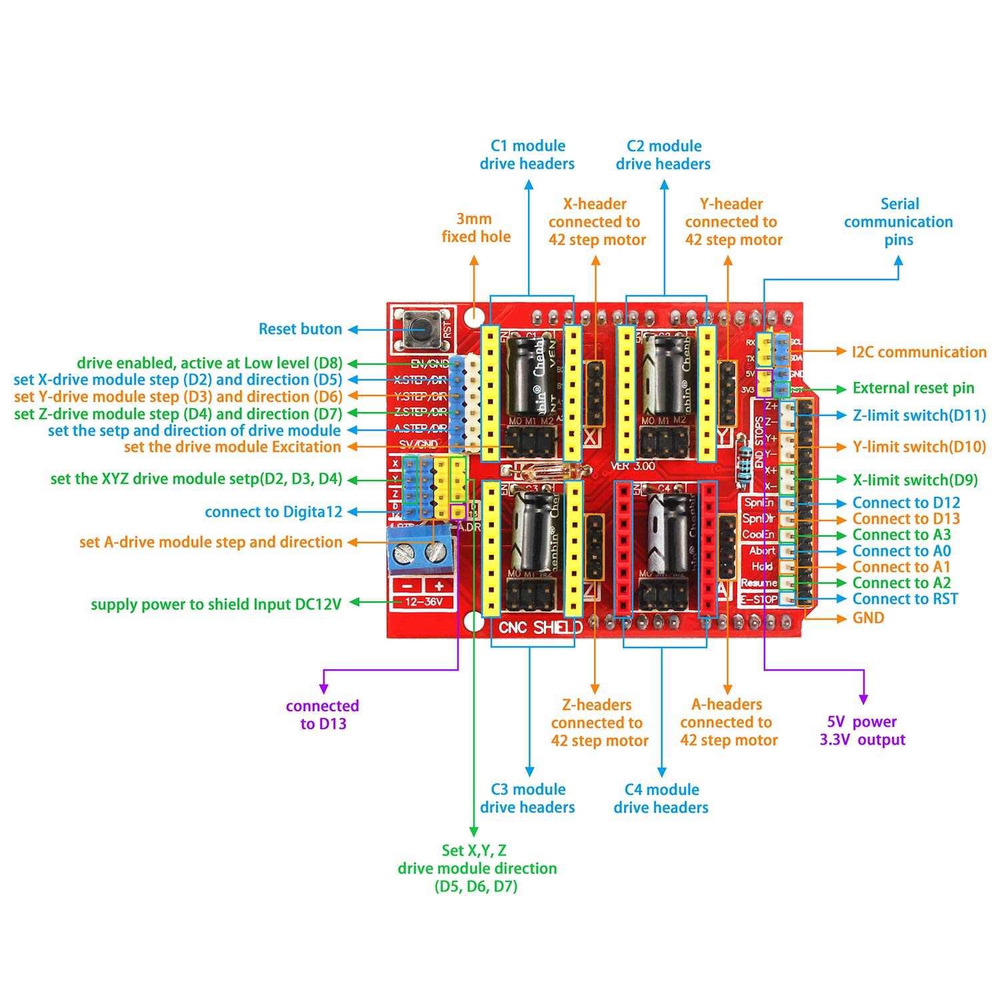

[](https://crates.io/crates/prinThor)
[](https://opensource.org/licenses/MIT)


<h3>Printhor: The highly reliable but not necessarily functional 3D printer firmware</h3>

<h5><p align="center"><i>If you are using this product or like the project, please <a href="https://github.com/cbruiz/printhor/stargazers">★</a> this repository to show your support! 🤩</i></p></h5>

# Overview

There are two base boards supported in this category.
The assumption/requirement is to use any of these generic purpose development board with the Arduino CNC Shield v3 (hat):


In these development boards, flash and run can be directly performed with probe-rs just connecting USB as they have a built-in SWD/JTAG interface:

### nucleo-f410rb
Please, note that this board is very limited in terms of flash and memory (48kB SRAM, 128kB flash).
You might not assume that a firwmare not optimized for size (LTO, etc...) will fit in flash.

Note: This target uses flip-link by default, requiring flip-link tool. To change this behavior please check .cargo/config.toml
```shell
cargo install flip-link
```

```shell
DEFMT_LOG=info RUST_BACKTRACE=0 RUSTFLAGS='--cfg board_stm32l4="nucleo64-f410rb"' cargo run --release --no-default-features --features nucleo_64_arduino_cnc_hat,nucleo64-f410rb --target thumbv7em-none-eabihf --bin printhor
```

### nucleo-l476rg
This one is a bit slower but much more RAM and flash. Enough even though with not very optimized firmware and many features

```shell
DEFMT_LOG=info RUST_BACKTRACE=0 RUSTFLAGS='--cfg board_stm32l4="nucleo64-l476rg"' cargo run --release --no-default-features --features nucleo_64_arduino_cnc_hat,nucleo64-l476rg --target thumbv7em-none-eabihf --bin printhor
```

